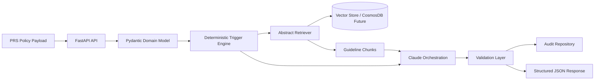

# Enterprise Underwriting AI Assistant POC

FastAPI proof of concept for first-pass homeowners underwriting review. The service accepts a normalized policy payload, runs deterministic trigger detection, retrieves relevant guideline chunks, drafts structured review artifacts, validates citations, and stores an audit record.

This POC does not make autonomous underwriting decisions.

## Architecture



## Project Structure

- `app/api`: FastAPI routes and dependency injection
- `app/core`: configuration, logging, tracing hooks
- `app/domain`: Pydantic policy, trigger, retrieval, LLM output, audit, and response models
- `app/services`: deterministic trigger engine
- `app/retrieval`: embedding, vector store, and retriever abstractions plus local in-memory retriever
- `app/llm`: Claude orchestration skeleton with deterministic local fallback
- `app/prompts`: versioned prompt template
- `app/validators`: post-generation validation
- `app/audit`: audit repository abstraction
- `app/ingestion`: sample offline ingestion CLI placeholder
- `app/workflows`: end-to-end review orchestration
- `config`: metadata-driven trigger rules
- `sample_data`: sample policy and mock guideline content
- `tests`: initial trigger and workflow tests

## Local Setup

Install `uv` if it is not already available:

```bash
curl -LsSf https://astral.sh/uv/install.sh | sh
```

Create the project environment, install dependencies, and start the API:

```bash
uv sync --extra dev
cp .env.example .env
uv run uvicorn app.main:app --reload
```

If Python 3.12 is not installed, let `uv` install and manage it:

```bash
uv python install 3.12
uv sync --python 3.12 --extra dev
```

Health check:

```bash
curl http://127.0.0.1:8000/health
```

Run a sample review:

```bash
curl -X POST http://127.0.0.1:8000/review-policy \
  -H "Content-Type: application/json" \
  --data @sample_data/policies/high_risk_home_policy.json
```

Fetch audit after a review:

```bash
curl http://127.0.0.1:8000/audit/POC-HOME-001
```

Run tests:

```bash
uv run pytest
```

## Example End-to-End Workflow

1. `POST /review-policy` receives a normalized `HomePolicy`.
2. The trigger engine evaluates JSON-configured rules from `config/trigger_rules.json`.
3. Trigger retrieval queries are passed to the abstract retriever.
4. The local POC retriever returns mock guideline chunks with citation metadata.
5. The Claude orchestration service produces structured JSON. Without `ANTHROPIC_API_KEY`, it uses deterministic POC output.
6. The validator enforces retrieval confidence and concern citation requirements.
7. The workflow stores a `ReviewAuditRecord`.
8. The API returns a structured `ReviewResponse` for the UI.

## Current POC Boundaries

- Retrieval is abstracted and currently implemented with deterministic in-memory keyword matching.
- Claude integration is scaffolded; the local fallback keeps the POC runnable without secrets.
- Guideline ingestion is a CLI placeholder for future PDF/DOCX extraction, chunking, embedding, and CosmosDB indexing.
- Authentication, RBAC, PII masking, and encryption are represented as architecture placeholders for future hardening.
